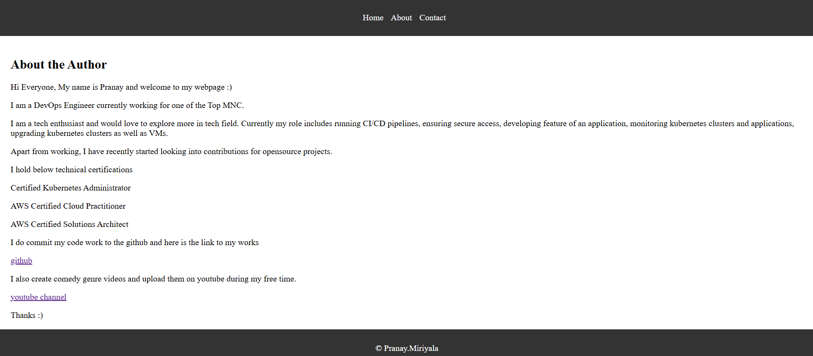

# Go Web Application

This is a simple website written in Golang. It uses the `net/http` package to serve HTTP requests.

## Running the server

To run the server, execute the following command:

```bash
go run main.go
```

The server will start on port 8080. You can access it by navigating to `http://localhost:8080/about` in your web browser.

## Looks like this




## Continuous Integration
Used Github actions to automate the process of testing the golang source code, building docker image and pushing it to docker-registry.
Once latest docker image is pushed to hub, CI will update the helm-chart with latest docker image tag and pushes helm-chart to repo.

## Continuous Deployment
### Install minikube to deploy argocd and go-web-app
One can follow this https://minikube.sigs.k8s.io/docs/start/?arch=%2Fwindows%2Fx86-64%2Fstable%2F.exe+download to install minikube on any platform.
Once it is installed, download and install argocd on minikube.
Then create go-web-app on argocd, so that it will be in sync with github repo. 

*** If ingress is used, then command "minikube tunnel" must be executed to route the traffic to ingress. 
